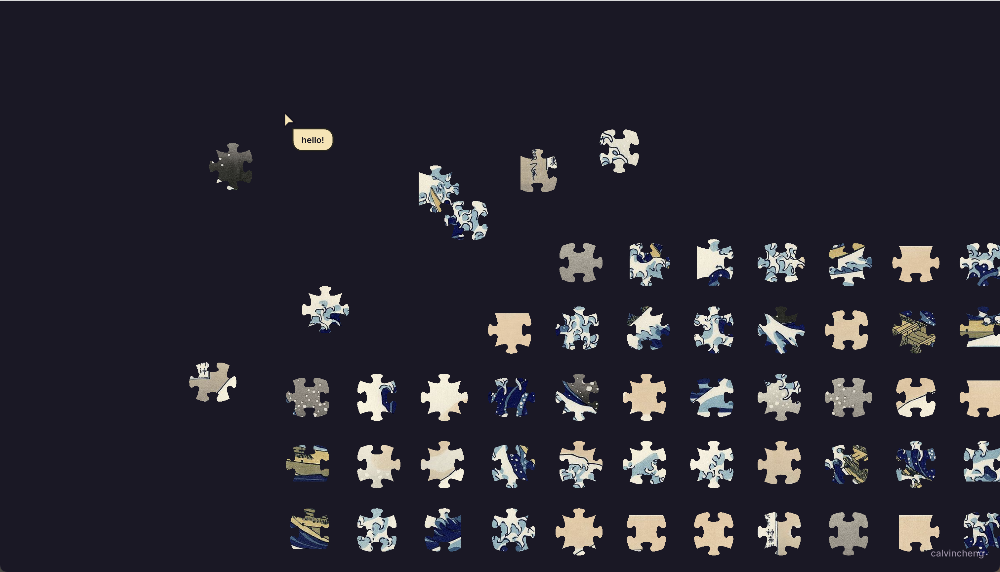

  
   
   
   

# jigly 🧩
  
A multiplayer jigsaw game, developed to experiment with CRDT and WebGL
technologies. 

[**Live demo available here**](https://calvincheng.github.io/jigly)

 

## Features

* Real-time collaborative multiplayer
* Live cursors
* Cursor chat (inspired by [Figma](https://figma.com))

(<a href="#top">back to top</a>)

## Usage

* Drag and drop pieces to complete the puzzle
* Press the `/` key to chat with other players
* Reset the puzzle by pressing 'New'

(<a href="#top">back to top</a>)

## Technologies used

* [yjs](https://github.com/yjs/yjs)
* [PixiJS](https://pixijs.com/)
* [React](https://reactjs.org/)
* [Emotion](https://github.com/emotion-js/emotion)

(<a href="#top">back to top</a>)

## License

Distributed under the [MIT License](https://github.com/calvincheng/jigly/blob/master/LICENSE.txt).

(<a href="#top">back to top</a>)

## Contact

Calvin Cheng - calvin.cc.cheng@gmail.com

Project Link: [https://github.com/calvincheng/jigly](https://github.com/calvincheng/jigly)

(<a href="#top">back to top</a>)

